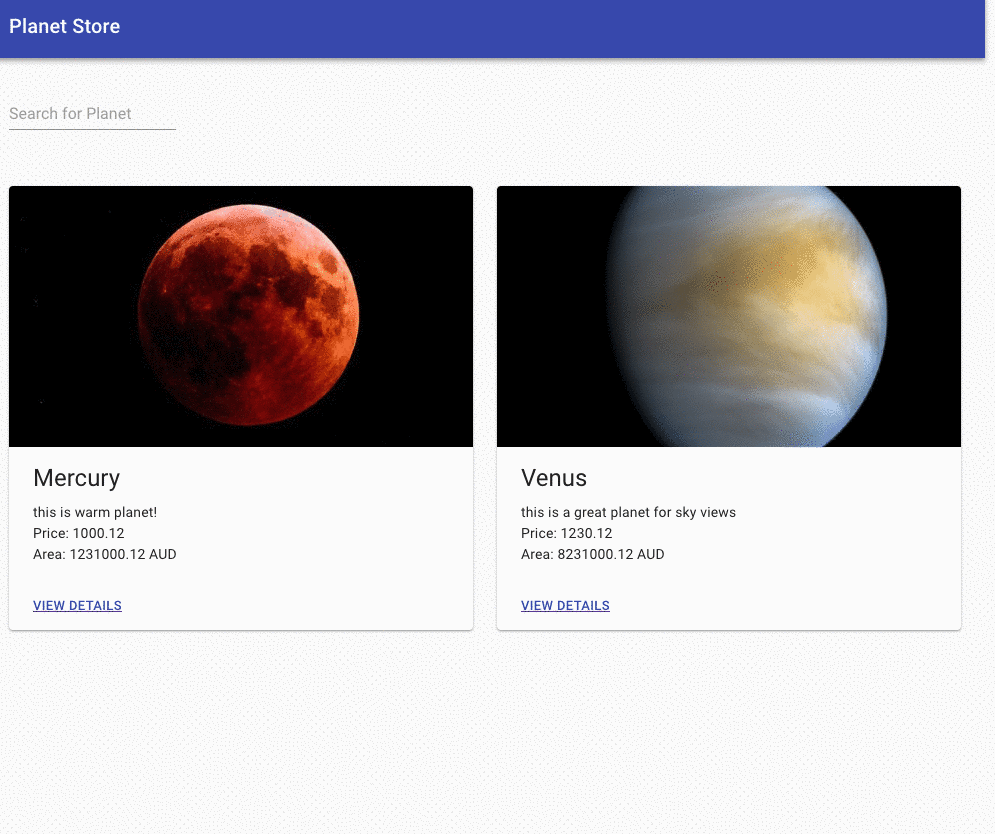

# Planet Store

## Description

A real estate marketing site to select your dream planet.

## Tech

- React (> v16.x)
- Material UI
- Node (v10.13.0)
- yarn or npm
- Jest

## Components

Following are the components:
- Navbar which is shown at the top of the page
- PlanetList - container component which fetches planets from the api
- PlanetCard - renders planet in card list
- Planet - renders planet details in a grid

## Demo



## Dev

```bash
yarn install
yarn start
```

## Linting and prettifying

```bash
yarn prettier
yarn lint
```

## Tests

```bash
npm run test
```
